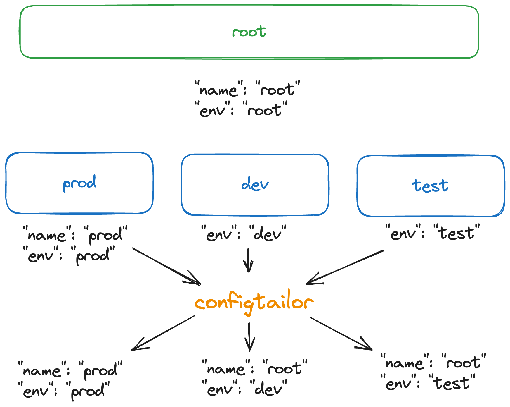
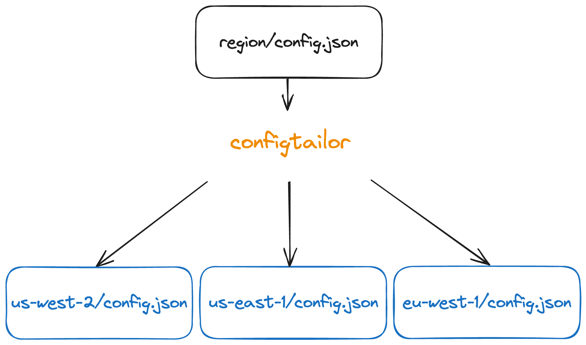

# ConfigTailor
ConfigTailor is a hierarchical configuration compiler that produces a config
file for all of your environments.

ConfigTailor makes it easy to manage your application configuration across any
dimension including regions, regions, and cloud accounts. ConfigTailor is used 
to produce JSON configuration files that are consumed by your application in
different environments.

## Extensions
ConfigTailor allows you to substitute and extend JSON values from parent
directories `config.json`.  For example, at the top level you can add a
`config.json` file with a global default value that you can override in subdirectories.
<p align="center">
    
</p>

In the example above, we define in the top level `root` that `"env": "root"` and
`"name":"root"`. While `prod`, `dev`, and `test` are all subdirectories. We then
override `"env"` in each subdirectory while only overriding `"name"` in `prod`.
This results in both values overwritten in `prod` while only `"name"` is plumbed
from root in `"dev"` and `"test"`. 

## Example Config
Follow a directory pattern like: 

```
config
├── config.json
├── dev
│   └── config.json
└── prod
    └── region
        └── config.json
```

file: `config/config.json`
```json
{
    "global_value": "set_everywhere",
}
```

### Variable Substitution
Example using the variable `region`.

file: `config/prod/region/config.json`
```json
{
    "base_uri": "$region.telophase.dev"
}
```

Then you can run `configtailor` with a region mapping `region:us-west-2,us-east-1,eu-west-1`:
```bash
configtailor compile --rootpath=config --mappings=region:us-west-2,us-east-1,eu-west-1
```

<p align="center">
    
</p>

Example output for `config_generated/prod/us-west-2/config.json`:
```json
{
    "global_value": "set_everywhere",
    "base_uri": "us-west-2.telophase.dev"
}
```

While also outputting the following files:
- `config_generated/prod/us-west-2/config.json`
- `config_generated/prod/us-east-1/config.json`
- `config_generated/prod/eu-west-1/config.json`
- `config_generated/dev/config.json`

View more detailed outputs by looking in the `example` directory and the
corresponding generated files in `example_generated`.

## Installing

Install the configtailor CLI via go.

```bash
go install github.com/santiago-labs/configtailor@latest
```

## Why?
In recent years, [cell architecture](https://aws.amazon.com/solutions/guidance/cell-based-architecture-on-aws/) has become more popular.

Application configuration becomes more complex with cell architecture. Copy and
pasting config files is prone to errors, so we built ConfigTailor to edit all of
our cell's configs in a single location.

For our configuration, we want:
- version control
- a single source of truth for each region's config

ConfigTailor enables this through a simple CLI that compiles configuration files
from a source directory structure.

# Obligatory Plug
If you like this project, at Telophase we are building tools to make it easier to
make your application multi-region or stand up cells. We'd love to chat if you
are building out cell infrastructure.  Reach out to us at <a href="mailto:team@telophase.dev">team@telophase.dev</a>
